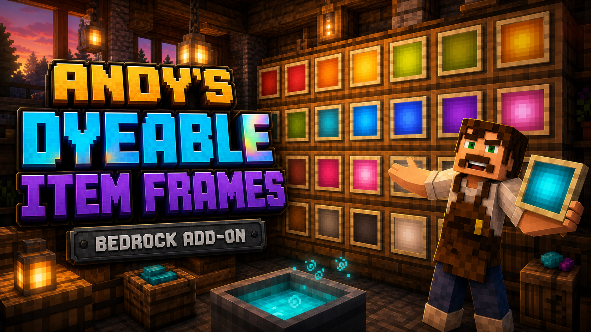

# Andy's Dyeable Item Frames



**Dye, display, and organize with item frames that finally match your build.**

Andy's Dyeable Item Frames is a Minecraft Bedrock add-on that adds dyeable versions of the normal Item Frame and Glow Item Frame. The custom frames use Bedrock's real leather-item dye system, so they can be colored through dyed cauldron water just like leather armor.

Only the leather center changes color. The wooden frame border keeps its familiar vanilla appearance, while glow variants receive a brighter, color-matched center. Placed frames retain native Bedrock item insertion, rotation, maps, comparator output, displayed-item drops, and Glow Item Frame rendering.

## Download

Download the ready-to-import add-on:

[**Andys_Dyeable_Item_Frames_3.1.2.mcaddon**](Andys_Dyeable_Item_Frames_3.1.2.mcaddon)

## Features

- Dyeable Item Frames and Dyeable Glow Item Frames
- All 16 standard Minecraft dye colors
- Bedrock's native `minecraft:dyeable` leather-item system
- Complete held frame stacks can be dyed in colored cauldron water
- Vanilla-colored wooden border with a dyed leather center
- Brighter, color-matched glow-frame centers
- Wall, floor, and ceiling placement
- Native displayed-item insertion, removal, rotation, maps, comparator output, and drops
- Dye color is preserved when frames are broken and placed again
- Crafting recipes unlocked by obtaining any dye
- `DyeFrameSettings` tool for rotation locking and line-of-sight labels
- No Cheats or experimental gameplay toggles required

## Requirements

- Minecraft Bedrock Edition 1.21.90 or newer
- Both included packs active at the same version

## Installation

1. Download `Andys_Dyeable_Item_Frames_3.1.2.mcaddon`.
2. Open the file with Minecraft Bedrock.
3. Wait for both included packs to import.
4. Create a world or edit an existing world.
5. Activate **Andy's Dyeable Item Frames BP** under **Behavior Packs → My Packs**.
6. Confirm that **Andy's Dyeable Item Frames RP** is active under Resource Packs.
7. Enter the world. No experiments are required.

Back up important worlds before installing or updating any add-on.

## Crafting

Both recipes are shapeless and use a Crafting Table.

```text
1 Item Frame + 1 Leather = 1 Dyeable Item Frame
1 Glow Item Frame + 1 Leather = 1 Dyeable Glow Item Frame
```

Obtaining any of Minecraft's 16 dyes unlocks both recipes in the recipe book.

## Dyeing Frames

1. Place a Cauldron.
2. Fill it with water.
3. Interact with the water while holding the desired dye.
4. Hold a Dyeable Item Frame or Dyeable Glow Item Frame stack.
5. Interact with the dyed cauldron water.
6. The held frame stack takes on that color.

If dyes are mixed into a custom shade, the placed frame uses the closest supported vanilla dye color.

## DyeFrameSettings

1. Rename a normal Stick to `DyeFrameSettings` in an Anvil.
2. Hold the renamed stick and interact directly with any placed Item Frame or Glow Item Frame, including vanilla frames.
3. Configure that individual frame:

- **Lock displayed-item rotation** prevents use-clicks from changing the displayed item's angle.
- **Show name while looking at frame** displays the frame label in the action bar while the player looks directly at it from within eight blocks.
- **Display name** sets an optional custom label of up to 80 characters.

Settings persist on each configured frame.

## Performance

A dyed or configured frame uses the native frame plus one lightweight visual marker. It is therefore slightly heavier than a completely untouched vanilla frame. Add very dense displays gradually on lower-powered devices, Realms, and multiplayer servers.

## Support and Creator

Created and published by **AndyTheMakerMC**.

- Website: [AndyTheMakerMC.xyz](https://AndyTheMakerMC.xyz)
- YouTube: [@AndyTheMakerMC](https://www.youtube.com/@AndyTheMakerMC)
- Twitch: [@AndyTheMakerMC](https://twitch.tv/AndyTheMakerMC)
- X: [@AndyTheMakerMC](https://x.com/AndyTheMakerMC)

## License

**All Rights Reserved. Copyright © 2026 Andy / AndyTheMakerMC.**

You may use the official, unmodified add-on in personal worlds, multiplayer worlds, Realms, servers, gameplay videos, livestreams, screenshots, tutorials, reviews, and showcases. You may not redistribute, reupload, mirror, resell, bundle, modify and publish, extract, reverse engineer, or reuse the add-on, its contents, branding, documentation, or artwork without prior written permission.

The promotional artwork is original AI-assisted concept artwork directed for this project. It is not an in-game screenshot.

Minecraft is a trademark of Microsoft Corporation. This independent project is not affiliated with, endorsed by, sponsored by, or associated with Microsoft or Mojang Studios.
